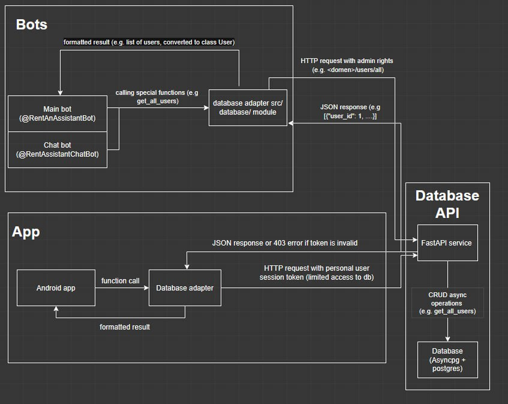
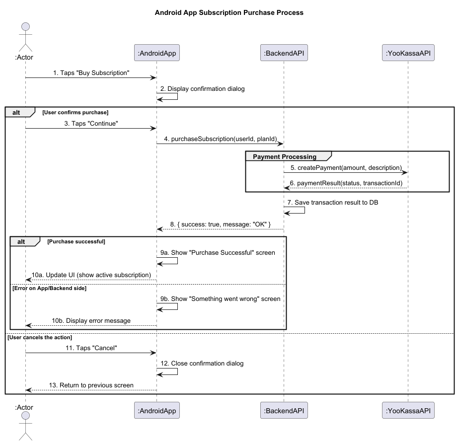
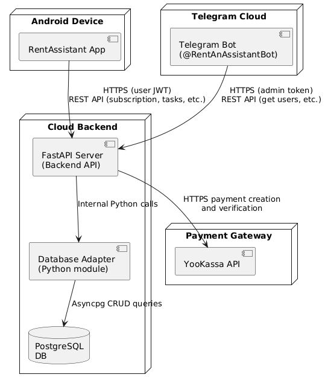

# Project Knowledge Base

This document serves as the single source of truth for the Rent Assistant project.

## Header Section

---

### Name and Logo

**Project Name:** Rent Assistant  
](https://github.com/bestSWPteam/RentAssistantApplication/blob/main/docs/assets/logo.jpeg))

### 🔹 One-liner Description

A smart task assistant that helps users create, manage, and delegate tasks to virtual assistants via Telegram bot or Android App.

### 🔹 Links

- ✅ **Deployed version:** [https://your-deploy-link.com](#)  
- 🎥 **Demo Video:** [https://your-demo-link.com](#)

---

## Body

---

### Project Goal and Description

Rent Assistant is a smart assistant platform designed to help users delegate personal or professional tasks through an intuitive interface.  
It allows users to interact via a Telegram bot or Android app, making task delegation easy, fast, and accessible from anywhere.

The project aims to:
- Streamline communication between users and assistants
- Provide a clean UI for creating and managing tasks
- Integrate payments and subscriptions through YooKassa
- Offer flexibility through both mobile and chatbot channels

### Project Context Diagram

This diagram illustrates how different components and external actors (User, Admin, Assistant) interact with the Telegram bot, Android app, and backend system, which in turn communicates with PostgreSQL and YooKassa.

### Feature Roadmap

This table summarizes the status and priority of all major functionality stages in the project.

| Stage                                          | Status     | Priority |
|------------------------------------------------|------------|----------|
| *MVP v0*                                       | ✅ delivered | Must     |
| MVP v1                                         |            | Must     |
| Basic bot functionality                        | ✅ delivered | Must     |
| Developed starting app page                    | ✅ delivered | Must     |
| MVP v2                                         |            |          |
| App frontend pages                             | ✅ delivered | Must     |
| Bot payment system                             | ✅ delivered | Must     |
| MVP v3                                         |            |          |
| App APK compiled file with basic functionality | 🚧 pending   | Must     |
| Bot assistant dashboard & assignment logic     | 🚧 pending   | Must     |
| MVP v4 *(beyond course)*                       |            |          |
| Item A                                         |            |          |
| MVP v5 *(beyond course)*                       |            |          |
| Item B                                         |            |          |

---

## Usage Instructions / Short User Guide

---

This section explains how to launch and use the MVP v2 version of our app.

### Installation

1. Download the APK file: [Download APK](https://disk.yandex.ru/d/gbnLd3yDOPZKYg)
2. Install the app on your Android device.
   - You may need to enable **“Install from unknown sources”** in your device settings.
3. Launch the app from your home screen.

---

### Authentication

- The app uses **Telegram authentication**.
- On launch, you’ll be redirected to authorize via Telegram.
- If you encounter login issues:  
  ⚠️ Some features may not work as expected due to current limitations in Telegram-based authentication (see [Deployment Note](https://docs.google.com/spreadsheets/d/17Lzh71TNYh9bJ2iMPZaI3bB_qQElKKTp-nbI8IE8AdA/edit?usp=sharing)).

---

### What you can test in MVP v2

✅ Available Features:
- App landing screen  
- Telegram-based login  
- Bot payment system flow (interface only)  
- Frontend UI for profile & assistant assignment  
- UI responses and navigation

🚧 Not yet available:
- Actual payment processing  
- Assistant assignment logic  
- Data persistence after logout

---

## Architecture
---
### Static view

#### UML Component Diagram

The static view of the system is illustrated using a UML Component Diagram. It shows the main components of the system — Bots, Android App, and Database API — and how they interact with each other through adapters and HTTP requests.

#### Coupling and Cohesion

- The project applies **loose coupling** — modules communicate through well-defined interfaces (e.g., HTTP API, function calls). This makes it easier to update or replace modules without affecting others.
- We maintain **high cohesion** — each class or module is focused on a single responsibility (e.g., `DatabaseAdapter`, `MainBot`, etc.). This improves code readability, debugging, testing, and maintainability.

#### Maintainability and Design Decisions

Our design choices significantly impact code maintainability:

- **Clear naming and structure**: Developers can understand the code faster, which reduces time spent on fixing bugs or adding features.
- **Modular structure**: While the file structure is clear and logical, we're still working on increasing modularity by splitting the logic into smaller, reusable packages.
- **Coupling & Cohesion**: Loose coupling and high cohesion ensure that:
  - Each module (e.g., `Database`, `Bot`, `App`) is self-contained and focused.
  - Debugging and refactoring are easier due to better separation of concerns.
- **DRY Principle**: We reuse code through functions and classes instead of copy-pasting, reducing the chance of bugs and making updates easier.
- **Documentation**: Proper documentation helps new developers understand the system faster and work more efficiently.
---
### Dynamic view

#### UML Sequence Diagram: Android App Subscription Purchase

This sequence diagram describes the dynamic flow of a **non-trivial scenario**: a user purchasing a subscription in the Android app.

It involves the following components and transactions:

- `:AndroidApp` — UI and session token handling;
- `:BackendAPI` — FastAPI server and business logic;
- `:YooKassaAPI` — external payment gateway;
- `DB` — transaction persistence.

It includes:
- Normal purchase flow
- Error handling (backend/UI failure)
- User cancellation flow
  

---

#### ⏱️ Report of Execution Time in Production

| Stage                              | Components                        | Timing  |
|------------------------------------|------------------------------------|---------|
| Full End-to-End (tap to result)    | :Actor → :App → :Actor             | 740 ms  |
| UI: Display Confirmation Dialog    | :AndroidApp → :AndroidApp         | 80 ms   |
| Network Request                    | :AndroidApp → :BackendAPI         | 520 ms  |
| Payment Gateway Call               | :BackendAPI → :YooKassaAPI        | 400 ms  |
| Save Transaction to DB             | :BackendAPI → DB                  | 40 ms   |
| Internal Backend Logic             | :BackendAPI                       | 20 ms   |
| Network Latency                    | App ↔ Backend                     | 60 ms   |
| UI: Process Response & Render UI   | :AndroidApp → :AndroidApp         | 140 ms  |

---

> ✅ This scenario is tested in production, and full interaction is completed within **~740 milliseconds**, which ensures a smooth UX.

---

### Deployment View

#### System Overview

This system consists of three primary components:

- Telegram Bot — the main interface used by both administrators and users
- Android Application — an alternative interface with the same functional capabilities
- Cloud Backend — FastAPI server with an adapter layer and PostgreSQL database

Each component is deployed independently, ensuring flexibility and scalability.

---
#### 1. Telegram Bot

- Deployed on: Remote server or cloud VM with public internet access  
- Role:  
  The bot serves as the main interface for interacting with the system.  
  It provides full functionality to users and administrators, such as viewing and managing tasks or subscriptions.  
  Communication with the backend is done via HTTPS requests with an admin token to access privileged endpoints (e.g., user listing, subscription control).

---

#### 2. Android Application

- Deployed on: User’s Android device  
- Role:  
  The mobile app offers an alternative way to use the system, replicating the bot's functionality.  
  It communicates with the backend using RESTful HTTP over HTTPS.  
  Although JWT tokens are designed for request authorization, the backend currently doesn’t validate them.  
  The app handles tasks, subscription management, and payment flows similarly to the bot.

---

#### 3. Backend API (FastAPI)

- Deployed on: Cloud VM or containerized environment (e.g., Docker on DigitalOcean or AWS EC2)  
- Role:  
  The FastAPI backend acts as the system orchestrator:
  - Processes requests from both the Telegram Bot and the Android App
  - Executes business logic for subscriptions, users, and tasks
  - Communicates with the PostgreSQL database
  - Integrates with YooKassa for payments

---

#### 4. Database (PostgreSQL)

- Deployed on: Managed cloud PostgreSQL service (e.g., Supabase, Railway, Render)  
- Role:  
  Stores persistent data: users, tasks, subscription types, and payment logs.  
  The FastAPI backend interacts with the DB asynchronously using asyncpg.

---

#### 5. Payment Gateway (YooKassa)

- Deployed on: External third-party infrastructure  
- Role:  
  Handles all payment-related operations.  
  The backend sends HTTPS requests to YooKassa to create and verify payments.  
  All sensitive information and card processing are handled securely on YooKassa’s side.

---

#### Deployment Rationale

- Primary interface as Telegram bot:  
  Most user interaction happens through the bot. The Android app is fully functional but designed as an alternative channel.

- Separation of responsibilities:  
  Clear boundaries between UI layers, backend processing, and data storage reduce coupling and simplify maintenance.

- Security:  
  All traffic goes over HTTPS. Admin-only features are protected using a special token in bot requests.

- Scalability:
  - Backend can be scaled horizontally
  - Database is cloud-managed and backed up
  - Bot and app are stateless and easily redeployable

- Reliability:  
  Cloud-based hosting and managed services ensure high availability.

- Maintainability:  
  Modular structure allows independent development of the bot, app, and server components.

---

#### Deployment Diagram

---

## Development

---

### Kanban board
We use a GitHub Project (Kanban board) to manage all development tasks.  
🔗 [View our Kanban board](https://github.com/orgs/bestSWPteam/projects/2)

#### Entry Criteria per Column
#### 🟣 ToDo: Ass
Tasks related to assignment logistics and reporting.
**Entry criteria:** Task is created for sprint tracking, reporting, quality, or documentation.

#### 🔴 ToDo: UX/UI
UI/UX specific improvements.
**Entry criteria:** Feature/design-related task that needs UX research, prototyping or UI implementation.

#### 🔵 ToDo: App Backend
Backend-related tasks including APIs, auth, messaging, deployment.
**Entry criteria:** Task is backend-focused, clearly scoped, assigned, and ready to begin.

#### 🟡 ToDo: App Frontend
Frontend-related tasks for the app UI (Android).
**Entry criteria:** Task is frontend-focused, design is approved (if applicable), and it’s ready for implementation.

#### 🟢 ToDo: Bot
Bot feature development.
**Entry criteria:** Task is related to bot logic, requirements are clarified, and it’s ready to be picked up.

#### 🟣 Done 
Tasks that are fully completed and meet the [Definition of Done](https://github.com/bestSWPteam/RentAssistantApplication/blob/main/CONTRIBUTING.md).

**Entry criteria:**  
The task must satisfy **all** of the following:
- All features work as intended.  
- No critical bugs or issues remain after testing.  
- Code is committed and pushed to the repository.  
- Discussed and approved by the team lead in Telegram.  
- Moved manually to the **Close** column on the board.

---

### Git workflow

We chose **GitHub Flow** because it is:
- Simple and developer-friendly.
- Suitable for short sprints with many small tasks.
- Focused on quality through pull requests and reviews.
- Fully supported by GitHub’s interface.

It allows us to move fast without sacrificing stability or collaboration.

#### Creating Issues from Templates

We use our issue templates to ensure consistency and clarity across all tasks.

Our templates:
- [Bug Report](https://github.com/bestSWPteam/RentAssistantApplication/blob/main/.github/ISSUE_TEMPLATE/bug-report.yml)  
  Used to report bugs with clear reproduction steps and expected behavior.
- [Technical Task](https://github.com/bestSWPteam/RentAssistantApplication/blob/main/.github/ISSUE_TEMPLATE/technical-task.yml)  
  For backend, refactoring, or implementation-related work broken down into subtasks.
- [User Story](https://github.com/bestSWPteam/RentAssistantApplication/blob/main/.github/ISSUE_TEMPLATE/user-story.yml)  
  Describes user-facing functionality with acceptance criteria.

All team members are required to use one of these templates when creating new issues.

#### Labelling Issues

We use a set of predefined GitHub issue labels to help organize and filter tasks.

Common labels include:
- **app**, **bot**, **backend**, **frontend** — to indicate the area or component.
- **ux/ui**, **customer feedback** — to highlight design or user-reported issues.
- **assX** — corresponds to assignment number (e.g., `ass3`, `ass5`).
- **sp:X** — indicates story points for planning (e.g., `sp:2`, `sp:5`).

Labels are chosen from an existing list during issue creation or triage.  
Adding labels is **optional but recommended** to keep the board organized and to improve team visibility.

Note: label colors are assigned automatically and may vary.

#### Assigning Issues to Team Members

Issue assignment is handled by the **Team Lead** during sprint planning.

- Each issue must be assigned to a responsible developer before implementation begins.
- No work should be started on unassigned issues.
- If an issue is unassigned and someone wants to work on it, they must first confirm it with the team lead.

This ensures clear responsibility, prevents duplication, and keeps sprint progress visible.

#### Creating, Naming and Merging Branches

We currently use three main branches in our project:

- `main`: the production-ready codebase
- `frontend`: all frontend-related development
- `backend`: all backend-related development

**Branching rules:**
- New features and fixes are currently developed directly within `frontend` and `backend` branches.
- No feature branches (`feature/...`) are used at this stage.
- Branch naming conventions for features may be introduced later as the project scales.

**Merging rules:**
- All merges are performed via **pull requests**.
- The merge method used is **Merge Commit** (to preserve commit history).
- **Any team member** can create and merge a pull request after review.
- Branches are **not deleted** after merging, as development in `frontend` and `backend` is ongoing.

### Commit messages format

We follow a simplified commit message format inspired by Conventional Commits:

<type>: <short summary>

Where `type` is one of:
- feat – for new features
- fix – for bug fixes
- docs – for documentation
- refactor – for refactoring code
- style – for formatting or naming changes
- test – for tests
- chore – for everything else

Example:
feat: add subscription upgrade option

#### Creating a Pull Request

All changes must go through a pull request (PR) before being merged into the `main` branch.

We use a [pull request template](https://github.com/bestSWPteam/RentAssistantApplication/blob/main/.github/pull_request_template.md) to keep our process consistent and to help reviewers quickly assess the change.

**PR requirements:**
- PR must include a link to the related issue using `Closes #issue_number`.
- Description of what has changed must be provided under **What's Changed**.
- The default checklist in the template must be reviewed and completed before submission:
  - ✅ Linked to a GitHub issue
  - ✅ Code follows style guidelines
  - ✅ Tests were added or updated (if applicable)
  - ✅ Documentation was updated (if needed)
  - ✅ Feature was tested manually

**Review process:**
- Each PR must be reviewed and approved by **at least one team member**.
- Reviewers check for code clarity, adherence to style, and functionality.

#### Code Reviews

All pull requests must go through at least **one review** before being merged.

**Rules and process:**
- PRs should be reviewed by **at least one team member** (excluding the author).
- **Self-approval is allowed**, since our team is small and sometimes only one person is available.
- Reviews are typically done **in GitHub comments** and optionally discussed **in Telegram calls**.
- There is no formal checklist enforced, but the team generally checks:
  - Code does what the task describes
  - No obvious bugs
  - Commit messages are understandable
  - Code does not break the app

> Note: our team members work on different parts of the codebase, so reviews are more lightweight and focused on visibility and tracking than on deep inspection.  
> As the project grows, we plan to introduce a more structured review process with stricter rules and review checklists.

#### Merging Pull Requests

All changes are merged into the `main` branch through pull requests.

**Merge rules:**
- **Any team member** is allowed to merge a PR once it's reviewed.
- We use the **Merge Commit** method to preserve individual commit history.
- **Branches are not deleted** after merge, since ongoing development continues in them.
- There is currently **no restriction** on merging without approval, but the team aims to review changes before merge whenever possible.

> As the project evolves, we may introduce stricter merge protections or branch policies to improve quality control.

#### Resolving Issues

We do not use auto-closing keywords like `Closes #X` in pull request descriptions.

**Issue closure process:**
- Issues can be closed **before or after the merge**, depending on when the task is fully complete.
- It is **preferred** that the author of the pull request closes the related issue manually.
- If the author forgets, the **team lead** is responsible for closing it during sprint wrap-up.

This approach ensures flexibility and clarity, especially when a task is completed outside of a pull request context.

### Gitgraph diagram

You can view the Git workflow diagram here:  
👉 [Gitgraph (Mermaid Live)](https://mermaid.live/edit#pako:eNqFUUuLgzAQ_ithwJsUNVXb3Ha77CLsoZdeFi9Ro4ZqUmJkH-J_38TWtrKFZU7zzfeCGSCXBQMCjjMgLrgmaEApVFy_KXqqUzjvXS0_d7JtuX6nGWssrFXP0GjHcVJxFQiEUD4xES-IkSbGlNPmAqYwMTJFRV6jjOZHJoqzqGb5UfZ6Cd47PZ8PBD3tE1RKhTTtjhfDx8R939VISM1LnlPNpehm-hzWUi4mpGWqYnO2ca6s0QK00vvypZJC_2m_RO9bvV4uBB0S1OWKMfGo_I22lw03_Q_JP6XnyGXraxEAFyrFCyD2Za49GwOzwmBNUtA1a5l9aQoFK2nfTF8ajexExYeU7axUsq9qICVtOrP1p4Jq9sJppeiNYhKZ2sleaCDBejN5ABngy6wbvMLYi9exF4fe1sORC99AfB-vvCBahzgOgyCMAjy68DPFeqvIj32ji_zAi_DWx-MvtMvgYg)

---

### Secrets management

To protect sensitive data such as tokens, API keys, and credentials, we follow these practices:

- The `.env` file is used for local development and is **added to `.gitignore`**, so it is not tracked in the repository.
- **CI/CD secrets** (such as tokens for GitHub Actions) are stored securely in **GitHub Secrets** and referenced in workflow files.
- Some configuration values may be defined in **project-level config files or inline YAML**, depending on developer preference.
- Team members are encouraged to avoid hardcoding secrets in the codebase.

> Note: Secrets management is a shared team responsibility, and we aim to improve consistency across developers in future sprints.

---

## Quality assurance

### Quality attribute scenarios

We selected three key quality attributes based on the ISO 25010 model: Availability, User Assistance, and Adaptability. These were confirmed with the client as essential for user satisfaction and system reliability.

Each attribute is described in detail in the file using the structured scenario format (stimulus, environment, artifact, response, response measure). These scenarios help us clearly define what it means for the system to meet quality expectations and how we plan to test those expectations.

See the full quality attribute scenarios in  
[docs/quality-assurance/quality-attribute-scenarios.md](docs/quality-assurance/quality-attribute-scenarios.md)

---

### Automated tests

Our team identified the most critical parts of the system that need to be tested to ensure a stable user experience:

- Telegram authentication flow — the main entry point for users. We simulate Telegram login callbacks, check token handling, and validate navigation intents. We use JUnit5, MockK, and Espresso for this.
  
- Task filtering logic — core business logic responsible for displaying tasks correctly. We test different filtering conditions using unit tests with JUnit5 and MockK.
  
- Screen navigation — making sure users are sent to the correct screen after login or interaction. We use Espresso to simulate user clicks and validate screen transitions.

We plan to extend testing to the Telegram bot and backend API in future development cycles.

---

### User acceptance tests

All user acceptance tests (UAT) are documented in the following file:

👉 [User Acceptance Tests](https://github.com/bestSWPteam/RentAssistantApplication/blob/main/docs/quality-assurance/user-acceptance-tests.md)

---

## Build and deployment
---
### Continuous Integration

We use GitHub Actions to build, scan, and validate our Docker image on every push and pull request to `main`.

- **Workflow file:** [`main_workflow.yml`](https://github.com/bestSWPteam/RentAssistantApplication/blob/main/.github/workflows/main_workflow.yml)
- **Static analysis tools:**
  - **Checkov** – scans the Dockerfile for security and configuration issues.
  - **Trivy** – scans the built Docker image for known vulnerabilities (CRITICAL and HIGH severity).
- **CI Workflow run results:** [GitHub Actions tab](https://github.com/bestSWPteam/RentAssistantApplication/actions)

Each tool will fail the pipeline if issues are detected, ensuring that only secure and properly configured code is pushed.
